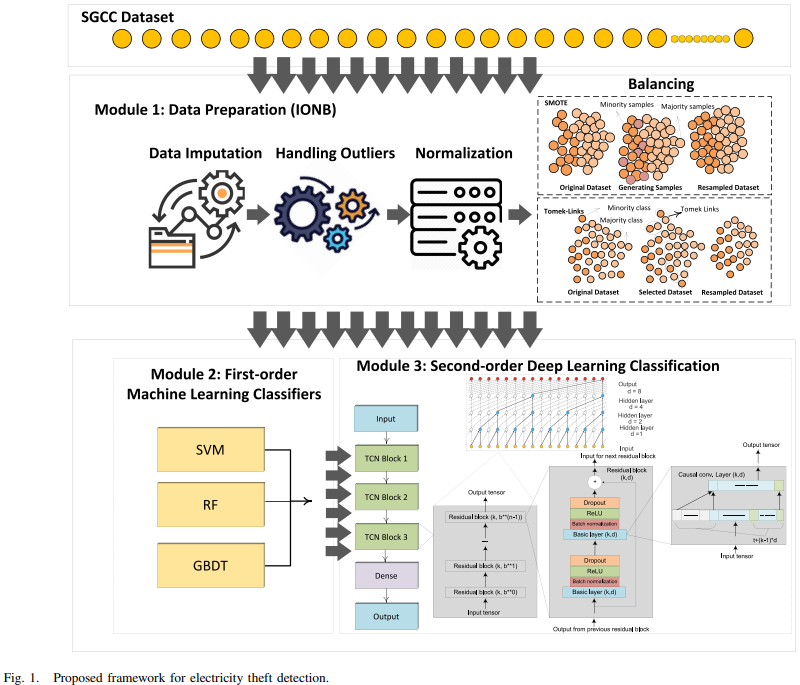

# Electricity Theft Detection in Smart Grids (PFSC Framework)

[](https://ieeexplore.ieee.org/document/9644473)
[](https://python.org)
[](https://tensorflow.org)

> **Published in:** IEEE Transactions on Smart Grid, Vol. 13, No. 2, March 2022  
> **Authors:** Inam Ullah Khan, Nadeem Javeid, C. James Taylor, Kelum A.A. Gamage, Xiandong Ma

---

## Overview

This repository implements the **PFSC (Preprocessing, First-order and Second-order Classification)** framework for electricity theft detection in smart grids using real-world data from the State Grid Corporation of China (SGCC).



## Key Results

| Method | Precision | Recall | F1-Score | AUC |
|--------|-----------|--------|----------|-----|
| SVM    | 0.774     | 0.771  | 0.627    | 0.92 |
| RF     | 0.791     | 0.744  | 0.437    | 0.94 |
| GBDT   | 0.791     | 0.744  | 0.437    | 0.94 |
| **PFSC (TCN)** | **0.964** | **0.954** | **0.959** | **0.985** |

## Installation

```bash
git clone https://github.com/dr-inamullahkhan/electricity-theft-detection.git
cd electricity-theft-detection
pip install -r requirements.txt
```

## Usage

```python
# Run with synthetic data (demo)
python pfsc_electricity_theft_detection.py

# Run with real SGCC data
# 1. Download SGCC dataset from: https://github.com/henryRDlab/ElectricityTheftDetection
# 2. Place in data/ folder
# 3. Uncomment load_sgcc_data() in main block
```

## Dataset

- **SGCC Dataset:** 42,372 users, 1,035 daily consumption features (2014–2016)
- **Class distribution:** 38,757 honest (91%) vs 3,615 fraudulent (9%)
- Download: [henryRDlab/ElectricityTheftDetection](https://github.com/henryRDlab/ElectricityTheftDetection)

## Citation

```bibtex
@article{khan2022stacked,
  title={A Stacked Machine and Deep Learning-Based Approach for Analysing Electricity Theft in Smart Grids},
  author={Khan, Inam Ullah and Javeid, Nadeem and Taylor, C James and Gamage, Kelum AA and Ma, Xiandong},
  journal={IEEE Transactions on Smart Grid},
  volume={13},
  number={2},
  pages={1633--1644},
  year={2022},
  publisher={IEEE}
}
```

## Contact

**Dr. Inam Ullah Khan**  
Postdoctoral Research Fellow, SMU Dallas  
📧 inamullah@ieee.org | 🌐 [Website](https://dr-inamullahkhan.github.io)
